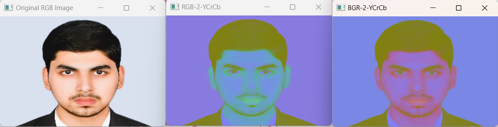
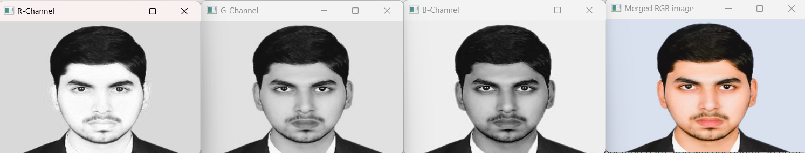
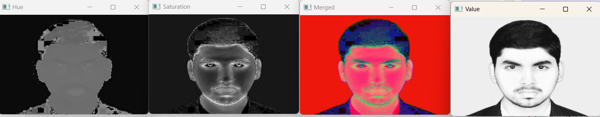

# COLOR_CONVERSIONS_OF-IMAGE
## AIM
Write a Python program using OpenCV that performs the following tasks:

i) Read and Display an Image.

ii) Draw Shapes and Add Text.

iii) Image Color Conversion.

iv) Access and Manipulate Image Pixels.

v) Image Resizing

vi) Image Cropping

vii) Image Flipping

viii) Write and Save the Modified Image


## Software Required:
Anaconda - Python 3.7
## Algorithm:
### Step1:
Load an image from your local directory and display it.

### Step2:
Draw a line from the top-left to the bottom-right of the image. o Draw a circle at the center of the image. o Draw a rectangle around a specific region of interest in the image. o Add the text "OpenCV Drawing" at the top-left corner of the image.

### Step3:
Convert the image from RGB to HSV and display it. o Convert the image from RGB to GRAY and display it. o Convert the image from RGB to YCrCb and display it. o Convert the HSV image back to RGB and display it.

### Step4:
Access and print the value of the pixel at coordinates (100, 100). o Modify the color of the pixel at (200, 200) to white.

### Step5:
Resize the original image to half its size and display it.

### Step6:
Crop a region of interest (ROI) from the image (e.g., a 100x100 pixel area starting at (50, 50)) and display it.

### Step7:
Flip the original image horizontally and display it. o Flip the original image vertically and display it.

### Step8:
Save the final modified image to your local directory.

## Program:
### Developed By: Shaik Shoaib Nawaz
### Register Number: 212222240094
### i) Read and display the image:
```
import cv2
image = cv2.imread('Desktop/dipt/COLOR_CONVERSIONS_OF-IMAGE/shoaib.png', 1)
if image is None:
    print("Error: Image not found. Please check the file path.")
else:
    image = cv2.resize(image, (200, 300))
    cv2.imshow('Shaik Shoaib Nawaz', image)
    cv2.waitKey(0)
    cv2.destroyAllWindows()
```
### ii)Write the image:
```
    import cv2
    image=cv2.imread('Desktop/dipt/COLOR_CONVERSIONS_OF-IMAGE/shoaib.png',0)
    cv2.imwrite('shoaib.png',image)
```
### iii)Shape of the Image:
```
    import cv2
    image=cv2.imread('shoaib.png',1)
    print(image.shape)
```
### iv)Access rows and columns:
```
    import random
    import cv2
    image=cv2.imread('Desktop/dipt/COLOR_CONVERSIONS_OF-IMAGE/shoaib.png',1)
    image=cv2.resize(image,(400,400))
    for i in range (150,200):
      for j in range(image.shape[1]):
          image[i][j]=[random.randint(0,255),
                       random.randint(0,255),
                       random.randint(0,255)] 
    cv2.imshow('part image',image)
    cv2.waitKey(0)
    cv2.destroyAllWindows()
```
### v)Cut and paste portion of image:
```
 import cv2
   image=cv2.imread('Desktop/dipt/COLOR_CONVERSIONS_OF-IMAGE/shoaib.png',1)
   image=cv2.resize(image,(400,400))
   tag =image[130:200,110:190]
   image[110:180,120:200] = tag
   cv2.imshow('partimage1',image)
   cv2.waitKey(0)
   cv2.destroyAllWindows()
```
### vi) BGR and RGB to HSV and GRAY:
```
import cv2
img = cv2.imread('Desktop/dipt/COLOR_CONVERSIONS_OF-IMAGE/shoaib.png',1)
img = cv2.resize(img,(300,200))
cv2.imshow('Original Image',img)
hsv1 = cv2.cvtColor(img,cv2.COLOR_BGR2HSV)
cv2.imshow('BGR2HSV',hsv1)
hsv2 = cv2.cvtColor(img,cv2.COLOR_RGB2HSV)
cv2.imshow('RGB2HSV',hsv2)
gray1 = cv2.cvtColor(img,cv2.COLOR_BGR2GRAY)
cv2.imshow('BGR2GRAY',gray1)
gray2 = cv2.cvtColor(img,cv2.COLOR_RGB2GRAY)
cv2.imshow('RGB2GRAY',gray2)
cv2.waitKey(0)
cv2.destroyAllWindows()
```
### vii) HSV to RGB and BGR:
```
import cv2
img = cv2.imread('Desktop/dipt/COLOR_CONVERSIONS_OF-IMAGE/shoaib.png')
img = cv2.resize(img,(300,200))
img = cv2.cvtColor(img,cv2.COLOR_BGR2HSV)
cv2.imshow('Original HSV Image',img)
RGB = cv2.cvtColor(img,cv2.COLOR_HSV2RGB)
cv2.imshow('2HSV2BGR',RGB)
BGR = cv2.cvtColor(img,cv2.COLOR_HSV2BGR)
cv2.imshow('HSV2RGB',BGR)
cv2.waitKey(0)
cv2.destroyAllWindows()
```
### viii) RGB and BGR to YCrCb:
```
import cv2
img = cv2.imread('Desktop/dipt/COLOR_CONVERSIONS_OF-IMAGE/shoaib.png')
img = cv2.resize(img,(300,200))
cv2.imshow('Original RGB Image',img)
YCrCb1 = cv2.cvtColor(img, cv2.COLOR_BGR2YCrCb)
cv2.imshow('RGB-2-YCrCb',YCrCb1)
YCrCb2 = cv2.cvtColor(img, cv2.COLOR_RGB2YCrCb)
cv2.imshow('BGR-2-YCrCb',YCrCb2)
cv2.waitKey(0)
cv2.destroyAllWindows()
```
### ix) Split and merge RGB Image:
```
import cv2
img = cv2.imread('Desktop/dipt/COLOR_CONVERSIONS_OF-IMAGE/shoaib.png',1)
img = cv2.resize(img,(300,200))
R = img[:,:,2]
G = img[:,:,1]
B = img[:,:,0]
cv2.imshow('R-Channel',R)
cv2.imshow('G-Channel',G)
cv2.imshow('B-Channel',B)
merged = cv2.merge((B,G,R))
cv2.imshow('Merged RGB image',merged)
cv2.waitKey(0)
cv2.destroyAllWindows()
```
### x) Split and merge HSV Image:
```
import cv2
img = cv2.imread("Desktop/dipt/COLOR_CONVERSIONS_OF-IMAGE/shoaib.png",1)
img = cv2.resize(img,(300,200))
img=cv2.cvtColor(img,cv2.COLOR_RGB2HSV)
H,S,V=cv2.split(img)
cv2.imshow('Hue',H)
cv2.imshow('Saturation',S)
cv2.imshow('Value',V)
merged = cv2.merge((H,S,V))
cv2.imshow('Merged',merged)
cv2.waitKey(0)
cv2.destroyAllWindows()
```


## Output:

### i) Read and display the image:


<br>
<br>

### ii)Write the image:

<br>
<br>

### iii)Shape of the Image:

<br>
<br>

### iv)Access rows and columns:


<br>
<br>

### v)Cut and paste portion of image:

<br>
<br>

### vi) BGR and RGB to HSV and GRAY:

<br>
<br>

### vii) HSV to RGB and BGR:

<br>
<br>

### viii) RGB and BGR to YCrCb:

<br>
<br>

### ix) Split and merge RGB Image:

<br>
<br>

### x) Split and merge HSV Image:

<br>
<br>


## Result:
    Thus the images are read, displayed, and written ,and color conversion was performed successfully using the python program.


